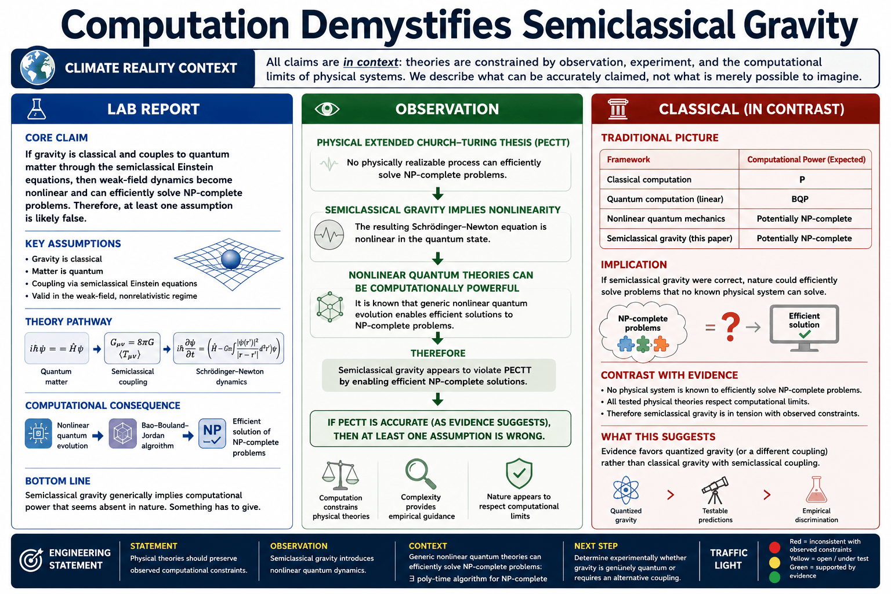

# Computation Demystifies Semiclassical Gravity

A collaborative lab report exploring how computational constraints inform the interpretation of semiclassical gravity.

This repository reconstructs the reasoning chain developed in **arXiv:2606.14806**, moving from semiclassical Einstein equations to Schrödinger–Newton dynamics, nonlinear quantum evolution, computational complexity, and implications for quantum gravity research.

---

## Core question

If gravity remains classical while matter remains quantum, do the resulting nonlinear dynamics permit efficient solutions to NP-complete problems?

If so, what should this imply for our interpretation of gravity?

---

## Paper

- **Title:** Computation Demystifies Semiclassical Gravity
- **arXiv abstract:** https://arxiv.org/abs/2606.14806
- **PDF:** https://arxiv.org/pdf/2606.14806
- **HTML:** https://arxiv.org/html/2606.14806v1

---

## Lab report

🌐 https://labreports.app/2606-14806/

The report summarizes the paper's argument and organizes the discussion through computational consequences rather than formal derivations.

---

## Hero figure



---

# Notebook roadmap

---
| Notebook | Purpose | Colab |
|-----------|----------|--------|
| **00_context.ipynb** | Establish the paper's context and core claim. | [Open in Colab](https://colab.research.google.com/github/thinkthoughts/semiclassical-gravity-computation/blob/main/notebooks/00_context.ipynb) |
| **07_complexity_classes.ipynb** | Explain why efficient NP-complete consequences matter physically. | [Open in Colab](https://colab.research.google.com/github/thinkthoughts/semiclassical-gravity-computation/blob/main/notebooks/07_complexity_classes.ipynb) |
| **13_schrodinger_newton_v2.ipynb** | Identify where nonlinear dynamics enter through the Schrödinger–Newton pathway. | [Open in Colab](https://colab.research.google.com/github/thinkthoughts/semiclassical-gravity-computation/blob/main/notebooks/13_schrodinger_newton_v2.ipynb) |
| **17_nonlinearity.ipynb** | Explain why nonlinear evolution changes computational power. | [Open in Colab](https://colab.research.google.com/github/thinkthoughts/semiclassical-gravity-computation/blob/main/notebooks/17_nonlinearity.ipynb) |
| **23_bao_bouland_jordan_v2.ipynb** | Reconstruct the computational architecture linking nonlinearity to efficient NP-complete solutions. | [Open in Colab](https://colab.research.google.com/github/thinkthoughts/computation-demystifies-semiclassical-gravity/blob/main/notebooks/23_bao_bouland_jordan_v2.ipynb) |
| **29_quantum_gravity_implications_v2.ipynb** | Explore how computational constraints inform interpretation of gravity. | [Open in Colab](https://colab.research.google.com/github/thinkthoughts/semiclassical-gravity-computation/blob/main/notebooks/29_quantum_gravity_implications_v2.ipynb) |

# Figures

## Notebook 07

**Computational pathway**

```
Semiclassical gravity
↓
Nonlinear dynamics
↓
Efficient NP-complete power
↓
PECTT tension
```

---

## Notebook 13

**Weak-field route to Schrödinger–Newton dynamics**

```
Semiclassical Einstein equation
↓
Weak-field limit
↓
Newtonian potential
↓
Quantum source
↓
Schrödinger–Newton dynamics
↓
Nonlinear evolution
```

---

## Notebook 17

**Computational consequences of nonlinear evolution**

```
Linear QM
↓
BQP baseline

Nonlinear QM
↓
Enhanced distinguishability
↓
Efficient NP-complete solutions
```

---

## Notebook 23

**Computational architecture of the Bao–Bouland–Jordan argument**

```
State dependence
↓
Nonlinear evolution
↓
Distinguishability amplification
↓
Decision extraction
↓
Efficient NP-complete solutions
```

---

## Notebook 29

**Computational constraints and quantum gravity interpretations**

```
Semiclassical gravity
↓
Schrödinger–Newton dynamics
↓
Nonlinear evolution
↓
Efficient NP-complete solutions
↓
PECTT tension
↓
Constraints on theory choice
      ↙         ↓          ↘             ↘
Semiclassical  Gravity   Alternative   Assumption
gravity        fundamentally gravitational sensitivity
incomplete     quantum    couplings
```

Observed computational limits narrow the space of plausible theories without uniquely determining one.

---

# Engineering statement

| Category | Statement |
|-----------|------------|
| **Statement** | Physical theories should remain consistent with observed computational constraints. |
| **Observation** | Semiclassical gravity may imply nonlinear quantum evolution. |
| **Context** | Nonlinear quantum evolution can produce efficient NP-complete consequences. |
| **Next step** | Experimentally discriminate among competing gravitational frameworks. |

---

# What this repository does not claim

This repository:

- does **not** demonstrate that gravity is quantum,
- does **not** falsify semiclassical gravity,
- does **not** reproduce the complete Bao–Bouland–Jordan proof.

Instead, it reconstructs the computational structure of the argument and records how computational evidence may inform physical interpretation.

---

# Repository structure

```text
.
├── README.md
├── paper.yaml
├── requirements.txt
├── statements/
│   └── 2606-14806.yaml
├── src/
│   └── semiclassical_gravity/
├── notebooks/
│   ├── 00_context.ipynb
│   ├── 07_complexity_classes.ipynb
│   ├── 13_schrodinger_newton_v2.ipynb
│   ├── 17_nonlinearity.ipynb
│   ├── 23_bao_bouland_jordan_v2.ipynb
│   └── 29_quantum_gravity_implications_v2.ipynb
├── figures/
├── results/
└── reports/
```

---

# Running the notebooks

Each notebook can be executed independently.

The recommended order is:

```text
00
↓
07
↓
13
↓
17
↓
23
↓
29
```

Artifacts are exported automatically to:

```text
results/
figures/
```

Colab download cells are included for generated outputs.

---

# Bottom line

The significance of **arXiv:2606.14806** is not merely that it proposes a computational consequence of semiclassical gravity.

The significance is that **observed computational constraints may themselves function as evidence relevant to theory choice in quantum gravity**.

Computational evidence narrows the space of plausible theories without uniquely determining one.

---

## Traffic light

🚦 **Green:** computational constraints matter.

🟡 **Yellow:** additional assumptions require careful examination.

🔴 **Red:** efficient NP-complete consequences remain in tension with observed computational limits.
